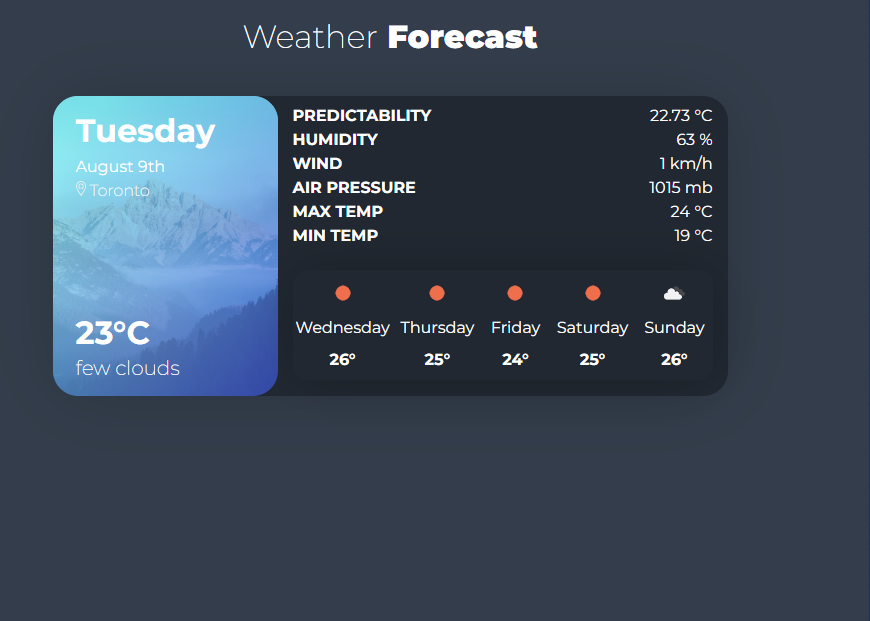

# Weather-react-app

WeatherApp is a project that utilizes ReactJS, custom hooks, and fetching data from a weather API service using Axios.  Dynamic data which allows you to find out the current weather and the week’s forecast

This project was created using HTML, CSS, React, BootStrap, and PropTypes

## Screenshots

